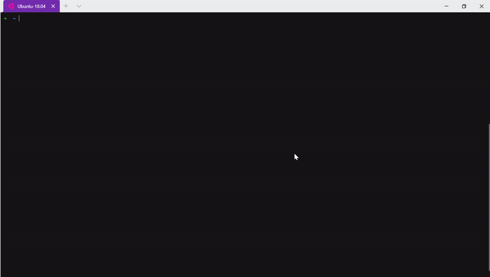

<h1 align="center">Phân tích cú pháp cấu trúc ngữ đoạn bằng thuật toán CKY</h1>
Đồ án thực hiện phân tích cú pháp cấu trúc ngữ đoạn trong tiếng Việt.<br/>
Sử dụng thuật toán Maxinum Matching để tách từ. Sau đó dùng thuật toán CKY để phân tích cú pháp. 

## Demo
<p align="center">
  
</p>

## Install
Option 1: Dùng git clone repo về
```sh
git clone https://github.com/UITTrinhQuangTruong/CS221.L11.git
```

Option 2: Tải trực tiếp trên trang github này

## Usage
Chắc chắn đã cài Python phiên bản >= 3.6<br/>
